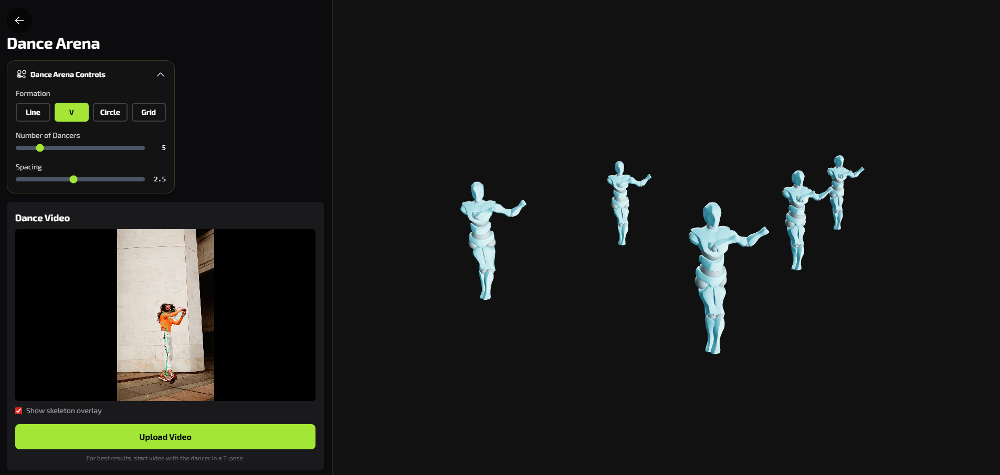

# MetaCloset

A digital wardrobe and Dance Arena app: try on garments in AR or with static images, and drive a crew of 3D avatars from a single dance video using pose tracking.



## Features

- **Home & catalog** – Browse garments and choose AR try-on or upload a photo.
- **Dance Arena** – Upload a dance video; pose is tracked with MediaPipe and retargeted to multiple 3D avatars in formations (Line, V, Circle, Grid).
- **AR experience** – Live camera try-on with garment overlay.
- **Static image** – Upload a photo and see the garment on an avatar.
- **Edit & share** – Choose a background and share or download your photo.

## Run locally

**Prerequisites:** Node.js (v18+)

1. Install dependencies:
   ```bash
   npm install
   ```

2. Run the dev server:
   ```bash
   npm run dev
   ```

3. Open the URL shown in the terminal (e.g. `http://localhost:5173`).

## Build for production

```bash
npm run build
```

Output is in the `dist` folder. Preview the build with:

```bash
npm run preview
```

## Tech stack

- React, TypeScript, Vite  
- Three.js (3D avatars and scene)  
- MediaPipe Pose Landmarker (dance video pose tracking)
